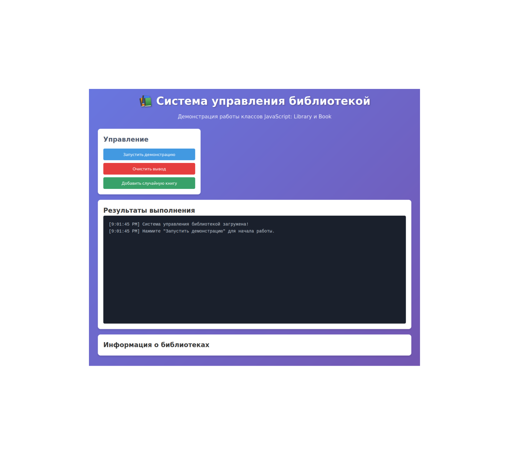
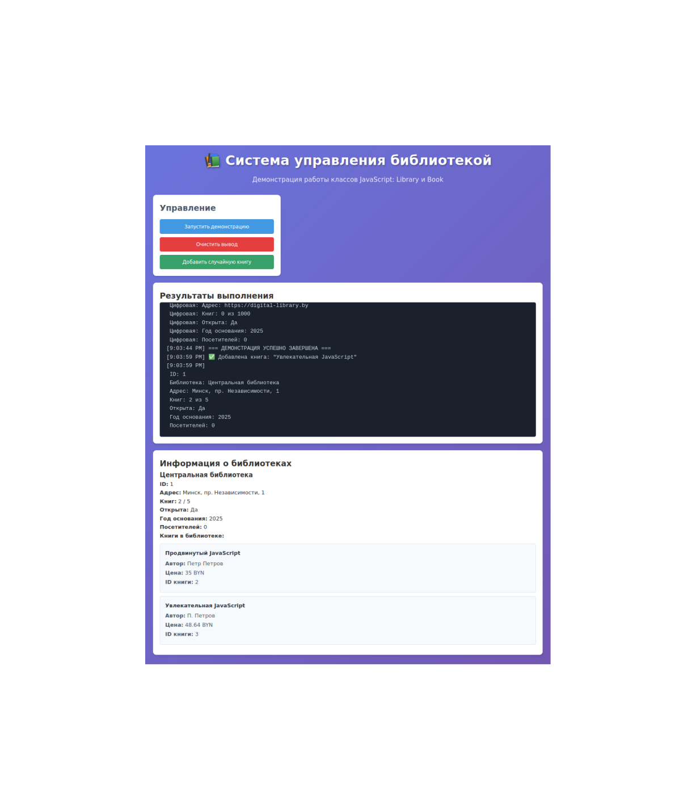

# 📚 Система управления библиотекой

Проект демонстрирует работу с классами и модулями в JavaScript на примере системы управления библиотекой. Проект разработан в рамках лабораторной работы №5 по теме "Классы и модули в JavaScript".

## Скриншоты работы проекта





## 📁 Структура проекта

```
ClassModules/
├── README.md
├── scripts/
│   ├── book.js              # Класс Book
│   ├── digital-library.js   # Класс DigitalLibrary (дочерний от Library)
│   ├── index.js             # Основной файл приложения
│   ├── index-object.js      # Базовый класс IndexObject
│   └── library.js           # Класс Library
├── styles/
│   └── styles.css           # Стили для веб-интерфейса
└── views/
    └── index.html           # Веб-интерфейс для демонстрации
```

## 🚀 Установка и запуск

Для запуска проекта локально выполните следующие шаги:

1. Убедитесь, что у вас установлен [Node.js](https://nodejs.org/)

2. Установите http-server глобально (если еще не установлен):
```bash
npm install -g http-server
```

3. Перейдите в корневую директорию проекта:
```bash
cd ClassModules
```

4. Запустите локальный сервер:
```bash
npx http-server .
```

5. Откройте в браузере следующий адрес:
```
http://127.0.0.1:8080/views/
```

## 📖 Описание классов

### IndexObject
Базовый класс, от которого наследуются все остальные классы в проекте.

**Поля:**
- `id` - уникальный идентификатор объекта

**Методы:**
- `constructor()` - создает экземпляр класса с уникальным ID
- `show()` - выводит ID объекта в консоль
- `destroy()` - удаляет экземпляр класса
- `static generateId()` - генерирует уникальный ID
- `static resetIdCounter()` - сбрасывает счетчик ID

### Book
Класс, представляющий книгу в библиотеке. Наследуется от IndexObject.

**Поля:**
- `title` (string) - название книги
- `desc` (string) - описание книги
- `author` (string) - автор книги
- `price` (number) - цена книги

**Методы:**
- `constructor(title, desc, author, price)` - создает экземпляр книги
- `show()` - выводит информацию о книге в консоль
- `delete()` - удаляет экземпляр книги
- `copy()` - создает копию экземпляра книги
- Геттеры и сеттеры для всех полей

### Library
Класс, представляющий библиотеку. Наследуется от IndexObject.

**Поля:**
- `books` (array) - массив книг в библиотеке
- `name` (string) - название библиотеки
- `address` (string) - адрес библиотеки
- `maxBookCount` (number) - максимальное количество книг
- `isOpen` (boolean) - статус открытия библиотеки
- `establishedYear` (number) - год основания
- `totalVisitors` (number) - общее количество посетителей

**Методы:**
- `constructor(name, address, maxBookCount)` - создает экземпляр библиотеки
- `addBook(book)` - добавляет книгу в библиотеку
- `addBooks(booksArray)` - добавляет массив книг в библиотеку
- `deleteBook(bookId)` - удаляет книгу по ID
- `show()` - выводит информацию о библиотеке в консоль
- `delete()` - удаляет экземпляр библиотеки
- `copy()` - создает копию экземпляра библиотеки
- `static clone(lib)` - создает новый экземпляр библиотеки на основе существующего
- Приватный метод `#resetBooks()` - очищает массив книг
- Приватный метод `#increaseVisitors()` - увеличивает счетчик посетителей
- Геттеры и сеттеры для всех полей

### DigitalLibrary
Дочерний класс от Library, представляющий цифровую библиотеку.

**Дополнительные поля:**
- `website` (string) - веб-сайт библиотеки
- `subscriptionPrice` (number) - цена подписки
- `isSubscriptionActive` (boolean) - статус активации подписки

**Дополнительные методы:**
- `constructor(name, address, maxBookCount, website, subscriptionPrice, isSubscriptionActive)` - создает экземпляр цифровой библиотеки
- `toggleSubscription()` - переключает статус подписки
- `show()` - выводит информацию о цифровой библиотеке в консоль (переопределен)
- `delete()` - удаляет экземпляр цифровой библиотеки (переопределен)
- `copy()` - создает копию экземпляра цифровой библиотеки (переопределен)
- `static clone(digitalLib)` - создает новый экземпляр цифровой библиотеки на основе существующего
- Приватные методы `#activateSubscription()` и `#deactivateSubscription()` - управляют статусом подписки
- Геттеры и сеттеры для всех полей

## 🎯 Соответствие требованиям лабораторной работы

Проект полностью соответствует требованиям лабораторной работы №5:

### ✅ Общие требования
- **Реализованы классы в соответствии с вариантом (Библиотека)**
- **Каждый класс имеет 3 поля разных типов** (string, number, boolean, array)
- **Реализованы геттеры и сеттеры для всех полей**
- **Реализованы публичные методы:** `constructor()`, `show()`, `delete()`, `copy()`
- **Реализован условно-приватный метод** в каждом классе
- **Реализован статичный метод** `clone()`

### ✅ Требования к дочернему классу
- **Создан дочерний класс DigitalLibrary**, наследующийся от Library
- **Добавлены новые поля** в соответствии с тематикой
- **Добавлены геттеры и сеттеры** для новых полей
- **Перезаписано поведение методов** `clone`, `show`, `delete`, `copy`

### ✅ Финальные требования
- **Создан index.html файл** с подключением index.js
- **В index.js импортированы классы** и созданы экземпляры
- **Реализован веб-интерфейс** для демонстрации работы классов

## 🎮 Использование веб-интерфейса

Веб-интерфейс предоставляет следующие возможности:

1. **Запуск демонстрации** - показывает полный цикл работы с библиотекой:
   - Создание библиотеки
   - Создание книг
   - Добавление книг в библиотеку
   - Копирование библиотеки
   - Удаление книг

2. **Добавление случайной книги** - генерирует и добавляет случайную книгу в библиотеку

3. **Очистка вывода** - очищает консоль вывода

4. **Информация о библиотеке** - отображает текущую информацию о библиотеке и книгах в ней

## 🔧 Технические детали

- Проект использует **ES6 модули** для организации кода
- Для локального запуска используется **http-server** для избежания проблем с CORS
- Веб-интерфейс создан с использованием **HTML5, CSS3 и современного JavaScript**
- Все классы используют **приватные поля** (синтаксис #) для инкапсуляции данных
